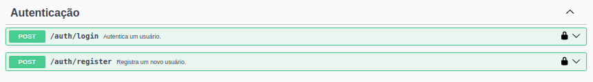
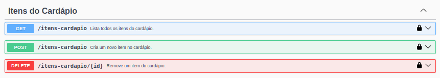
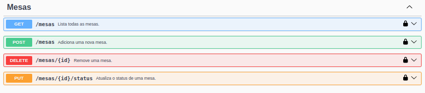
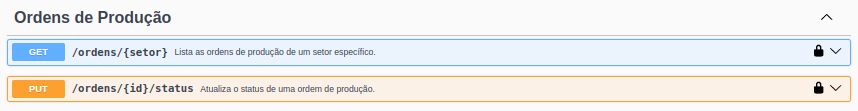
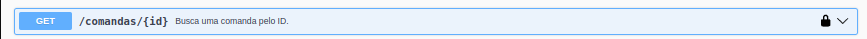
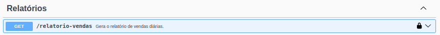
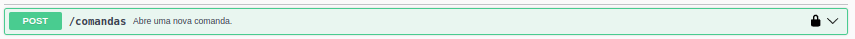
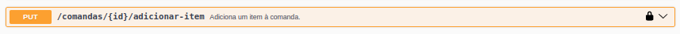
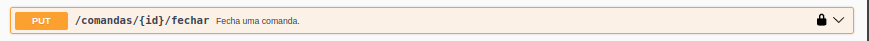

### Basic Project with NodeJS + Express (PostgreSQL)

**Necessário ter os dados do postgres no .env e o banco restaurantedb criado"

### Run project Api:
```
cd restauranteapi
npm install
npx sequelize-cli db:migrate --config config/config.cjs
node server.js
```

### Documentation
http://localhost:3000/api-docs/#/

### Register and Token
```
Authorization: Bearer token
```
**Doc**: http://localhost:3000/api-docs/#/Autentica%C3%A7%C3%A3o



# Fluxo Admin

- **Verificar itens do cardápio**

    **Doc**: http://localhost:3000/api-docs/#/Itens%20do%20Card%C3%A1pio
    

- **Verificar mesas**
    **Doc**: http://localhost:3000/api-docs/#/Mesas
    

- **Copa ou Cozinha precisam ver as ordens de produção e atualizar**

    **Doc**: http://localhost:3000/api-docs/#/Ordens%20de%20Produção
    

- **Ver Comanda**

    **Doc**: http://localhost:3000/api-docs/#/Comandas/get_comandas__id_
    

- **Ver relatório de vendas**

    **Doc**: http://localhost:3000/api-docs/#/Relatórios
    


# Fluxo Cliente

- **Criar comanda**

    **Doc**: http://localhost:3000/api-docs/#/Comandas/post_comandas
    

- **Adicionar itens do cardápio a comanda**

    **Doc**: http://localhost:3000/api-docs/#/Comandas/put_comandas__id__adicionar_item
    

- **Fechar comanda**

    **Doc**: http://localhost:3000/api-docs/#/Comandas/put_comandas__id__fechar
    

